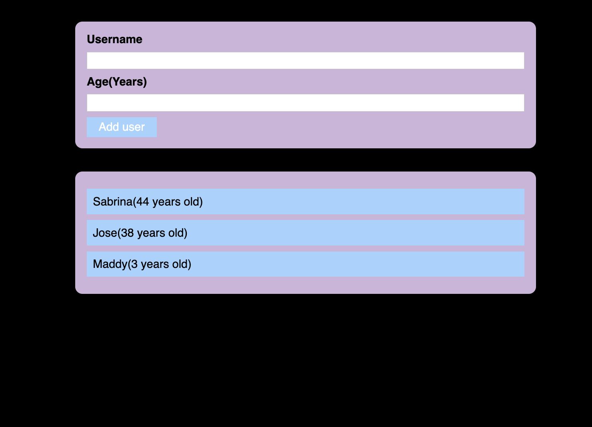

# Simple user form with Error modal - (Course: "React - The Complete Guide" from: Udemy)

## Description

Simple user form with Error Modals. Use of Fragments, Portals and Refs.  

Created following Udemy course : https://www.udemy.com/course/react-the-complete-guide-incl-redux/.

Styles where changed using https://coolors.co/palettes/trending.

## Screenshot

## Table of Contents   
  - [Description](#description) 
  - [Screenshot](#screenshot) 
  - [Installation](#installation) 
  - [Usage](#usage)
  - [License](#license)
  - [Contributing](#contributing)
  - [Credits](#credits)
  - [Questions](#questions)

##  Installation 

     - No installation required.

##  Usage 

Use the form to add user and see how they appear on the screen . Error modals will appear when validation is not met. 

##  License 
MIT License   
                        Copyright 2023 sabrina-martorelli   
                        Permission is hereby granted, free of charge, to any person obtaining a copy of this software and associated documentation files (the "Software"), to deal in the Software without restriction, including without limitation the rights to use, copy, modify, merge, publish, distribute, sublicense, and/or sell copies of the Software, and to permit persons to whom the Software is furnished to do so, subject to the following conditions:  
                        The above copyright notice and this permission notice shall be included in all copies or substantial portions of the Software.   
                        THE SOFTWARE IS PROVIDED "AS IS", WITHOUT WARRANTY OF ANY KIND, EXPRESS OR IMPLIED, INCLUDING BUT NOT LIMITED TO THE WARRANTIES OF MERCHANTABILITY, FITNESS FOR A PARTICULAR PURPOSE AND NONINFRINGEMENT. IN NO EVENT SHALL THE AUTHORS OR COPYRIGHT HOLDERS BE LIABLE FOR ANY CLAIM, DAMAGES OR OTHER LIABILITY, WHETHER IN AN ACTION OF CONTRACT, TORT OR OTHERWISE, ARISING FROM, OUT OF OR IN CONNECTION WITH THE SOFTWARE OR THE USE OR OTHER DEALINGS IN THE SOFTWARE.
##  Contributing 
When contributing to this repository, please first discuss the change you wish to make via issue, email, or any other method with the owners of this repository before making a change.

##  Credits

1.https://www.udemy.com/course/react-the-complete-guide-incl-redux/

2.https://coolors.co/

##  Questions

 Additional questions? Please contact me at [sabrina.martorelli@gmail.com ](mailto:sabrina.martorelli@gmail.com).